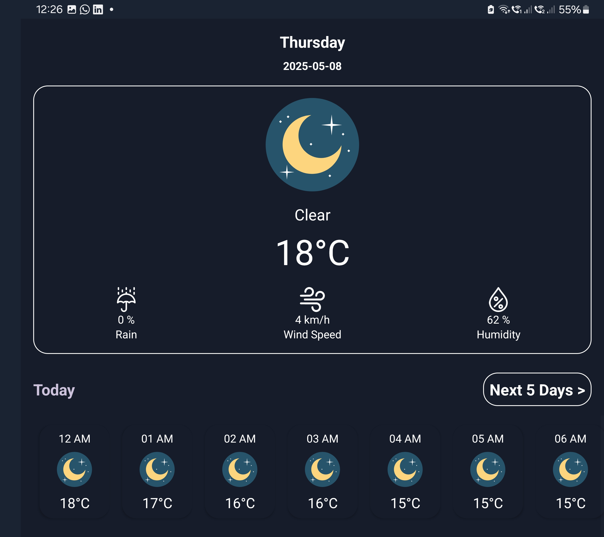
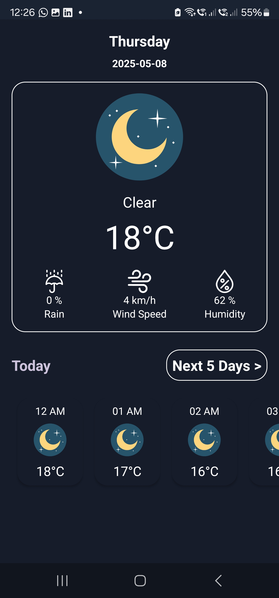
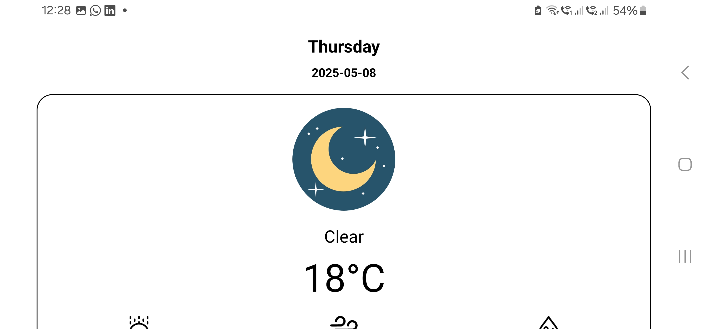
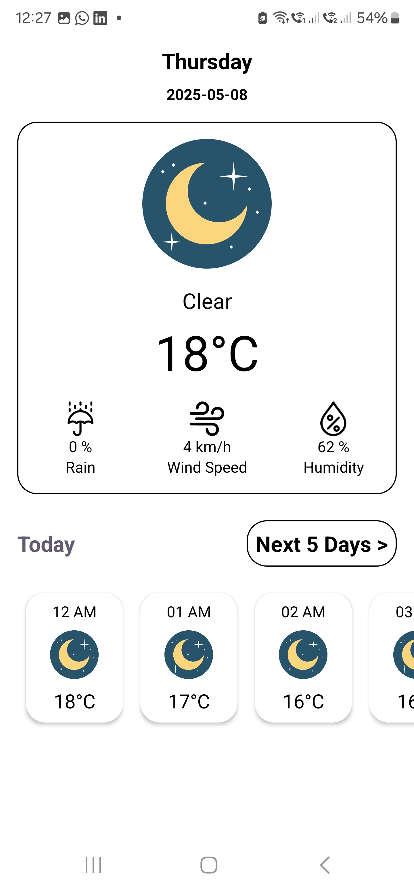
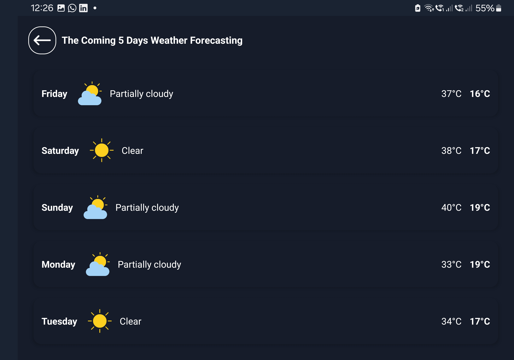
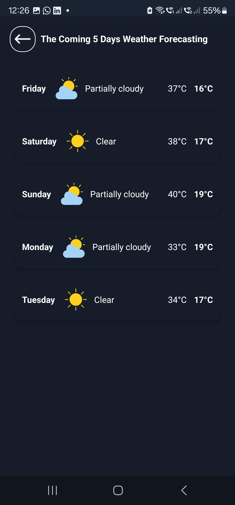
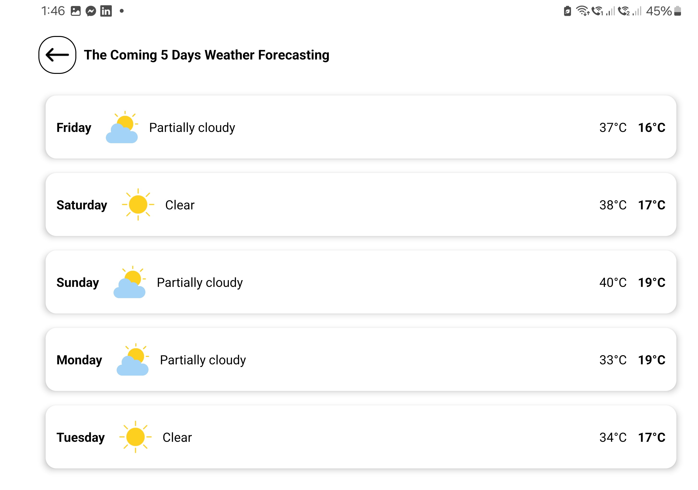
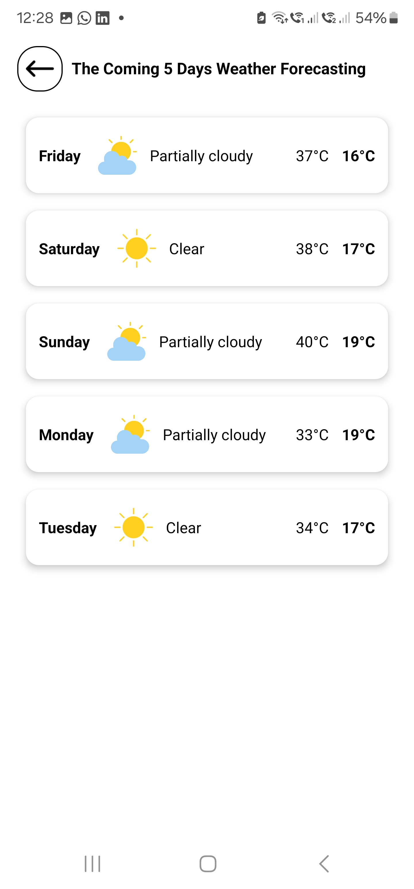

# ☁️ Instabug Weather App

## 📥 Download APK

You can download the debug APK here:

👉 [Click here to download the debug APK](apk/app-debug.apk)

---

## 🧑‍💻 Android Internship Task 2025

This is a **Weather Tracking App** developed for the **Instabug Android Internship 2025**.

It was built **without using any third-party libraries** — everything from networking to local storage is built manually using pure Android SDK.

---

## ✅ Features

- 🔐 Checks if **location permissions** are granted  
- 📍 Checks if **GPS is enabled**  
- 🗺 Gets **user location** using the device’s GPS (latitude & longitude)  
- 🌤 Retrieves **current weather**  
- 📆 Shows a **5-day forecast**  
- 🔁 **Swipe-to-refresh** on the current weather screen  
- 📴 Handles **offline mode** and displays error messages  
- 💾 **BONUS:** Caches the last retrieved data in **SQLite** for offline access  
- 🔄 **BONUS:** Handles **screen rotation** and configuration changes without losing data  

---

## 🧱 Clean Architecture

The app follows **Clean Architecture** with separation of concerns between:

### 📊 Presentation Layer

- `TodayForecastViewModel`, `IncomingDaysForecastViewModel`
- Fragments for Today & 5-Day Forecast
- Uses **LiveData** to update UI reactively
- Handles offline states, swipe-to-refresh, and rotation

### ⚙ Domain Layer

- Entities like `TodayForecast`, `DayForecast`
- Use cases like `GetTodayForecastUseCase`
- Repository interfaces + Result wrappers (`Result`, `LocationResult`)

### 📡 Data Layer

- **Location**: Handles permission and GPS state natively
- **Remote API**: Uses `HttpURLConnection` to fetch weather data (NO Retrofit)
- **Local Cache**: Uses **manual SQLite** for storing last weather data (NO Room)
- **Repository**: Picks between cache or remote based on network availability

---

## 🛠 Technical Details

| Feature                  | Implementation                                  |
|--------------------------|--------------------------------------------------|
| Language                 | Kotlin + XML                                     |
| Network                  | `HttpURLConnection` (no third-party libraries)   |
| Local Storage            | `SQLite` (no Room)                               |
| Architecture             | Clean Architecture                               |
| UI Framework             | Fragments + ViewModel + LiveData                 |
| Multithreading           | Custom **Thread Pool** (`Executors`)            |
| Main Thread Safety       | No blocking on UI thread                         |
| Offline Support          | Cached latest forecast in SQLite                 |
| Configuration Changes    | Fully supported (rotation, theme, etc.)          |
| Swipe-to-Refresh         | Manual refresh for current weather               |

---

## 📸 Screenshots

| Current Weather - Dark (Landscape)                                | Current Weather - Dark (Portrait)                                |
|-------------------------------------------------------------------|------------------------------------------------------------------|
|     |      |

| Current Weather - Light (Landscape)                               | Current Weather - Light (Portrait)                               |
|-------------------------------------------------------------------|------------------------------------------------------------------|
|   |    |

| 5-Day Forecast - Dark (Landscape)                                 | 5-Day Forecast - Dark (Portrait)                                 |
|-------------------------------------------------------------------|------------------------------------------------------------------|
|   |    |

| 5-Day Forecast - Light (Landscape)                                | 5-Day Forecast - Light (Portrait)                                |
|-------------------------------------------------------------------|------------------------------------------------------------------|
| |  |

---

## 📌 Notes

- Built **100% from scratch** using **native Android SDK** only.  
- No use of any third-party tools like Retrofit, Room, Hilt, etc.  
- Demonstrates **manual handling** of all system services including:
  - Permissions  
  - Location updates  
  - Network requests  
  - Local data storage  

---

## 👨‍💻 Developed by

**Mina Maher**  
[GitHub Profile](https://github.com/mina0maher)

---
