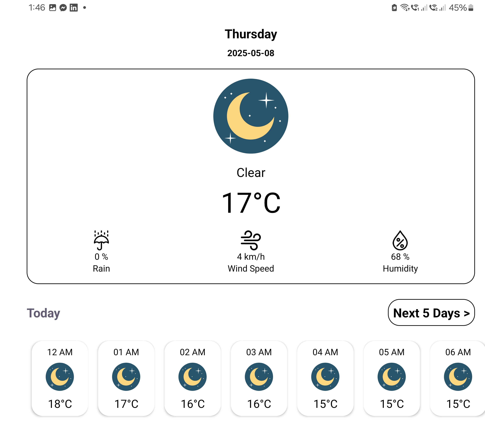

# Android Internship Task 2025

## Summary

This project is a **Weather Tracking App** built for the Instabug Android Internship Task 2025.  
It meets the following requirements:

✅ Check if the user has granted permissions and if GPS is enabled
✅ Get the user's location using device GPS (latitude, longitude)  
✅ Get current weather and 5-day forecast using a weather API  
✅ Two screens:  
- **Current Weather Screen**  
- **5-Day Weather Forecast Screen**  
✅ Swipe-to-refresh on the current weather screen  
✅ Handles offline state and shows an error message  
✅ **BONUS:** Caches the last retrieved data for offline use  
✅ **BONUS:** Handles configuration changes like screen rotation

---

## 📐 Architecture Overview

The app follows **Clean Architecture** with three main layers:

---

### 🏗 Data Layer
- Remote (API) → `HttpURLConnection`
- Local (Cache) → `SQLite`
- Location → checks permissions + GPS status
- Repository → picks between remote/local based on network

---

### ⚙ Domain Layer
- Models → clean entities (`TodayForecast`, `DayForecast`, etc.)
- Repositories → abstract interfaces
- Use Cases → app logic (`GetTodayForecastUseCase`, etc.)
- Helpers → unified `Result`, `LocationResult`

---

### 🎨 Presentation Layer
- ViewModels → 2 (`TodayForecastViewModel`, `IncomingDaysForecastViewModel`)
- Fragments → Today + 5-day screens
- LiveData → reactive UI updates
- Swipe-to-Refresh → manual refresh
- Offline support → cached data + error messages
- Handles config changes (e.g., rotation)

---

## Technical Details

- **Languages**: Kotlin + XML  
- **Supports**:
  - Screen rotation (configuration changes)
  - Multiple screen sizes
  - Light and dark themes

- **Used Tools**:
  - `HttpURLConnection` (no third-party libraries like Retrofit or Volley)
  - `SQLite` (no Room)

---

## Screenshots

| First Screen - Dark (Landscape) | First Screen - Dark (Portrait) |
|---------------------------------|--------------------------------|
|  |  |

| First Screen - Light (Landscape) | First Screen - Light (Portrait) |
|----------------------------------|---------------------------------|
|  |  |

| Second Screen - Dark (Landscape) | Second Screen - Dark (Portrait) |
|----------------------------------|---------------------------------|
|  |  |

| Second Screen - Light (Landscape) | Second Screen - Light (Portrait) |
|-----------------------------------|----------------------------------|
|  |  |

---

